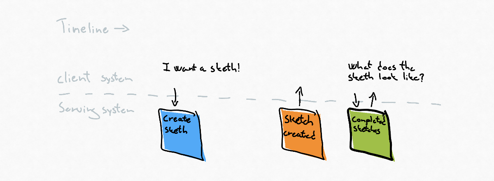

# Event storming interactions

## Key take ways
  
* There are 3 interactions between systems and users: commands, domain events and read models.
* A process or a subprocess can be identified by a starting command and an ending event.
* The idea of 3 types of interaction translates well into our solution space.
* When communication between assemblies focuses on one direction of communication at a time.
* Don't get caught up in the underlying technologies focus on the intent of the interactions.

## Introduction

There are 7 artifacts in event storming we use to model the behavior of a system: Command, Aggregate, External system, Domain event, Read model, Ui and Policy.

3 out of those 7 artifacts will potentially interact with either the human user or other systems. The 3 artifacts are commands, domain events and read models. Our system can expose endpoints where commands can be issued, domain events or summary events can flow out of our system in streams, other systems can subscribe to or inform users of an event important to them. Read models can be exposed to users via user interfaces or to other systems via application programming interfaces facilitating decision making by giving insights into data in the context of our system.

## Directions of interactions

We can define 3 realms: the real world, our system and other systems, we can place borders between these realms and on top of these borders place our commands, domain events and read models to illustrate what direction these interactions can go.

The real world can only use commands to interact with our system, and our system can only use events and read models to interact with the real world.

All interactions can happen in both directions between our system to other systems. Other systems can use our read models, subscribe to our domain events and command our system to do something. Our system can look up data in other systems thou read models, our system can subscribe to events it finds useful, and it can command other systems to do something.

## Deeper meaning of the 3 interactions

### Command

The command is a call to action, an expression of our intent for something to happen or to be created.\
A command has 3 properties: a subject, who should do the work to fulfill our intent, our intent: create, remove, start, stop, etc. and a potential payload of information needed to execute the command.\
3 things can invoke a command; a user interacts with our system, another system interacts with our system and a policy within our system that invokes a command on a set of predefined conditions.

### Domain event

Domain events are things that *have* happened within the domain which is relevant for the real world. They only occur at the end of a process and are indisputable facts about the state change.\
The emitter of events doesn't know who will receive the events and what they will do with them, they only know what has changed to what new state, and where to broadcast it.\
A good analogy would be a radio tower emitting data over a specific wave frequency. You can tab into the stream of data coming from the tower if you have a radio receiver and know the correct frequency, what you do with the stream of data after you receive it is up to you.

### Read model

Read models lets us query data within the system, we query because we want to know something, we have questions that the system can answer for us by letting us define some boundaries within our query and returning the items that fall within the boundaries we have defined in our queries. we can use the results of our queries in a decision making process either in our brain or in other systems.

## Order of interactions

When doing an event storming session, the order of these interactions is arbitrary: a command starts work in the aggregate or external system resulting in an event being emitted which could be aggregated into a view presented to the user by a user interface.\
This process can also be reflected in code: command can be issued to a command handler doing work resulting in an event being emitted which an event handler acts upon updating a read model.\
A thing worth noticing is that all processes mapped out in an event storming starts with a desire for something manifested by a command, and every process where we change state in our system ends with an event. This means we can easily identify sub processes by drawing boundaries around commands and events.

## Choosing an interaction

You don't have to put very much thought into interactions if you model your systems flow of control in the same way as an event storming canvas. But the 3 interactions identified above is not exclusively bound to the event storming canvas and our system, they are also a great tool to reason about how we communicate between assemblies and users in our software solutions. When we need an assembly to interact with another assembly to accomplish a goal, we can ask our self what kind of interactions do we want to happen between them to accomplish the desired goal.\
When doing so, our focus on only one direction of communication between the assemblies at a time: how does assembly A convey its desire or state change to assembly B. Only when that is done should we focus on how assembly B convey its desire or state change to assembly A. This keeps us away from the trap of using the wrong medium to convey our intents and state between the assemblies.\

Pitfalls could be:

* Sending commands disguised as domain events.
* Sending commands and blocking execution flow while waiting for a long running process to finish to return the result of the process.
* Building systems that have side effects of querying to facilitate doing commands disguised as queries.
* Emitting obese events instead of creating read models.

We can mix interactions between assemblies as our heart desires as long as we are mindful of the reason why we are crossing the boundary between the assemblies:

I want you to do something, and I need some data that you have. Moreover, I want to act when your state changes.

### I want to know something in my own time

The client system is interested in some of the serving systems data, but the client won't or can't listen to the serving systems stream of events.

The client can query the serving system about the current state when it feels like it, and This could be every 5 seconds, every 5 minutes every 5 hours etc.

The client accepts that it won't have the freshes data all of the time, but it gets complete control over when it wants to receive the data.

### I want to be informed when you change state, and I want some of your data

The client is interested in keeping its data as up to date as possible with the serving systems data. 

The client can subscribe to the stream of events that the serving systems emits and make a query when a state the client system is interested in has happened. 

In this example, the events are so thin (have so little data) that the client system needs to do a query to get all the data it desires, but the emitted events could also be so fat that the client system doesn't need to make the query.

### I want you to do something, and I want the result of that process

The client wants the serving system to create something that doesn't exist yet.

To do so, the client systems issue the serving system command and leaves it to do its work. The serving systems emit an event when the work is done, and the client systems pick up the result of the work by making a query against the serving systems read model.

## Final thoughts

Interactions are a subset of the 7 event storming artifacts and a great way to indicate how we intend to interact within our system and with systems outside of our control. Focusing on the interactions instead of the technology beneath gives us a layer of abstraction that allows us to communicate our intent of the interactions easily. What does my system want from your system, what does your system need from my system? What type of interaction should we use to facilitate our desired outcome?