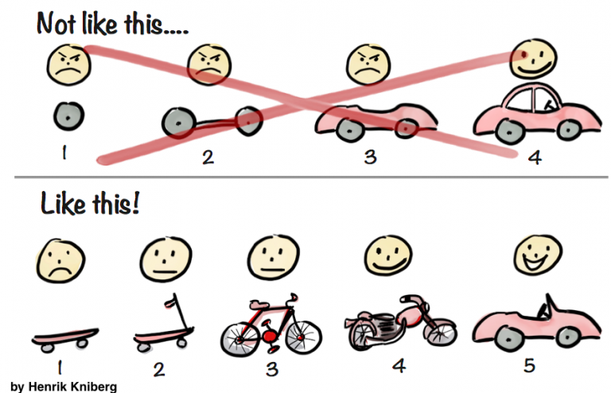
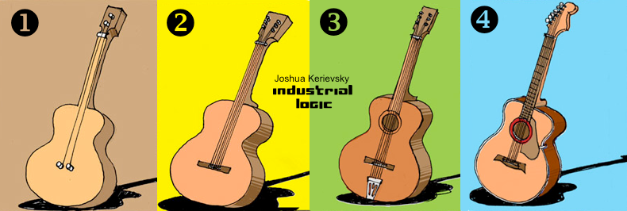

Summary of Simon Browns YOW! conference talk about [The lost art of software design](https://www.youtube.com/watch?v=XPSZC3mJRO0&t=2286s). 

Teams have thrown away big design up front which is great, but they have also thrown away diagramming and modelling.

> Big design up front is dumb. Doing no design up front is even dumber.
>
> -- *Dave Thomas*

We need to do *some* design up front.

Simon have written [books](https://simonbrown.je/#:~:text=Writing) about software architecture.

Simon build his product [Structurizr](https://structurizr.com/) by doing some design up front and continuing with [evolutionary design](https://mozaicworks.com/blog/what-is-evolutionary-design/#:~:text=Evolutionary%20Design%20is%20the%20practice,an%20iterative%20and%20incremental%20approach.)

Simon have been running workshops all over the world where he have asked the participants to draw diagrams. None knows how to.

Much Literature about agile development doesn't mention design up front, which leads us to assume no design is required.

The people who wrote the [agile manifesto](https://agilemanifesto.org/principles.html) have tons and tons of experience, your software team does not.

Agile development requires a large toolbox of different techniques and practices. Unfortunately many developers have only a few different tools and not many are taught to new developers.   

We don't articulate how we do the actual software design, we merely state we are using our experience, but what makes use chose one solution over the other?

When building software we shouldn't be using the MVP approach, where it is required to rebuild our solution at every iteration. Instead we should build software with evolutionary design.  

*Author/Copyright holder: Henrik Kniberg.*

*Author/Copyright holder: Joshua Kerievsky.*

https://www.industriallogic.com/blog/evolutionary-design/

Do enough upfront design to have a starting point and a direction.

The design upfront will uncover unknown unknowns, or things you didn't know you didn't know but are important.

It is very hard to make sense of the result of a whiteboard session after you are done with it. The conversation is over and all parties have their own understanding of the outcome and this understand will shift with time.

Drawing diagrams without UML leads to different interpretations of the meaning of the diagrams.

WHen you are drawing diagrams always ask:
1. Is that what we are going to build?
1. Is it going to work?

> Architecture represents the significant decisions, where significance is measured in cost of change.
>
> -- *Grady Booch*

The [c4 model](https://c4model.com/) is a great common language for software design  

The [diagram review checklist](https://c4model.com/review/)

>Continuous attention to technical excellence and good design enhances agility.
>
> [12 Principles Behind the Agile Manifesto](https://www.agilealliance.org/agile101/12-principles-behind-the-agile-manifesto/)

Diagrams shouldn't lead to the following types of questions:
* What does this arrow mean?
* Why are some boxes red?
* Is that a Java application?
* Is that a monolithic application or a collection of microservices?
* How does the users get their reports?

The kind of questions you should have about diagrams should be:
* What protocol are your two Java applications using to communicate with each other?
* Why do you have two separate C# applications instead of one?
* Why are you using MongoDB?
* Why are you using MySQL when our standard is Oracle?
* Should we really build new applications with .Net Framework rather than .NET Core? 

Identify and mitigate your highest priority risks by using [risk storming](https://riskstorming.com/):
1. Draw a diagram
1. Get people together who has a interest in what you are building: developers, architects, operations staff, site reliability engineers, support staff.
1. Ask what do you perceive will be risky with what we are building/changing?

Once you have identified potential risks do concrete experiments:
* [Proof of concept](https://sensinum.com/proof-of-concept-in-software-development/)
* [Prototype](https://www.guru99.com/software-engineering-prototyping-model.html)
* [Spike](https://www.visual-paradigm.com/scrum/what-is-scrum-spike/)
* [Tracer bullets](https://flylib.com/books/en/1.315.1.25/1/)
* [Vertical slices](https://agileforall.com/vertical-slices-and-scale/)
* [Walking Skeleton](https://www.henricodolfing.com/2018/04/start-your-project-with-walking-skeleton.html)

Do upfront design until:
* You understand the significant architectural drivers (scaling, performance, security and the restrains of the environment)
* You can draw a [context diagram](https://www.edrawmax.com/context-diagram/)

* You understand significant design decisions (technology, modularity)
* You have a way to communicate your technical vision to other people.
* You think your solution will work, and you have planned how to put it under stress.
* You have identified, and are comfortable with the key risks

There are many tools to ensure you get your initial design correct:
* [Workshops(pdf)](https://www.ebgconsulting.com/Pubs/Articles/WorkshopsInSDprojects-Gottesdiener.pdf)
* [Interviews](https://www.nngroup.com/articles/user-interviews/)
* [Event storming](https://medium.com/nick-tune-tech-strategy-blog/eventstorming-modelling-tips-to-facilitate-microservice-design-1b1b0b838efc)
* [Impact mapping](https://www.plays-in-business.com/impact-mapping/)
* [domain modelling](http://www.cs.sjsu.edu/~pearce/modules/lectures/ooa/analysis/DomainModeling.htm)
* [Object-oriented analysis and design](https://en.wikipedia.org/wiki/Object-oriented_analysis_and_design)
* CRC
* [Domain driven design](https://concisesoftware.com/architecture-tradeoff-analysis-method-atam/)
* Architecture reviews
* [architecture tradeoff analysis method](https://concisesoftware.com/architecture-tradeoff-analysis-method-atam/)
* Architecture dry runs
* [Risk-storming](https://riskstorming.com/)
* Concrete experiments
* [c4 (System context, Containers, Components, code) model](https://c4model.com/)
* [Architectural Decision Records](https://adr.github.io/)

Do Architecture katas to practice design and communication, some great katas are:
[Ted Newards architectural Katas](https://archkatas.herokuapp.com/)

[Neal Ford architectural Katas](http://nealford.com/katas/list.html)

You should check out the talk [Modular Monoliths](https://www.youtube.com/watch?v=5OjqD-ow8GE)

[Just Enough Software Architecture](https://www.georgefairbanks.com/e-book/)

--- Trash ---
decomposition techniques
* 
modular programming
Class Responsibility Collaborator model

https://www.youtube.com/watch?v=XPSZC3mJRO0&feature=youtu.be&t=797