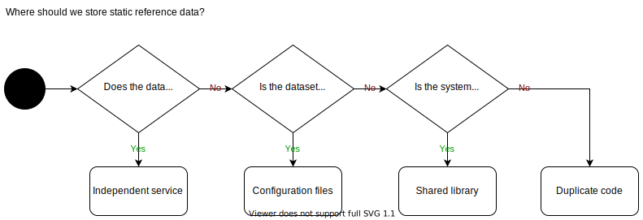

# Where to store static data

Many systems make use of data that doesn't change very often, maybe once every 5 years, once a year or once a month; this data is referred to as static data. We can store this data in many ways, depending on our needs and the tradeoffs we are willing to accept. The following decision tree illustrates a very simple approach to placing your static data in the most optimal place in your system.

## Independent service

Build either a single service for static data or a service for each type of static data you have to get a single source of truth that consumers can query.

### Advantages

* Clients can cache the result of querying the service and thereby manage their own cache invalidation of the static data.
* The service can have an endpoint for adding data to the dataset, making this much easier updating the data than other approaches to storing static data.
* The service can be enabled to broadcast an event when the data change, making updating interested parties a none event. 

### Drawbacks

* The extra overhead of needing to deploy and manage the life cycle of an assembly. This can be cheap if you already have a template for how you build, deploy and manage a micro service. 
* It can be hard to get the approval and resources for spawning a new service, whereas you won't need to ask permission for other approaches.
* You get all the issues that come along with having a service. These include but are not limited to: service downtime, network issues, consumers needing an instance of the service or a test double to preform tests dependent on the static data.

## Configuration files

Create configuration files that can be loaded into the services that contain your static data.

### Advantages

* Can hold big or complex sets of data
* Data can be reloaded without a new deployment of the assembly.

### Drawbacks

* Ensuring all replicas of the data is up to date can be tricky. This is not an issue if you have a low number of assemblies that needs the data or you have a solid way of keeping track of where copies of the data exist.

## Shared library

Place the static data in a library that can be linked by any assembly needing the data. The library can be distributed via a package manager like Npm, Yarn or NuGet. 

This works well if you have small volumes of data and you can live with different assemblies having different versions of the data.    

### Advantage

　　　The package manager will make the version of the static data each assembly visible.

### Drawbacks 

* All consumers of the dataset need to be redeployed to update their internal dataset. 
* With different teams being in charge of maintaining different parts of the system, the lead time to getting all consumers to use the latest version of the data may become very long. The team may not be aware that there is a new version of the data available or they may not care.

## Duplicate code 

Write the static data as code in each assembly that needs access to it. Copy/paste between each solution in the same programming language.

### Advantages

* Next to no cost of exposing the dataset. All you need to do is write some code.
* The static data can be represented in any programming language; simply write a collection containing the data in the given language.

### Drawbacks 

* You need to update the data in multiple places. This may not be an issue if you only rarely change the static data.
* The dataset can be hidden deep in your code where you may not even know it exits and is being used.
* It is not suitable for large datasets.
* All consumers of the dataset needs to be redeployed to update their internal dataset.

## Conclusion

None of the described patterns fit every case; they each come with advantages and drawback, I suggest you focus on how often the data changes and how many places it will be used when making a decision on what pattern to use when storing static data.   

## Source 

The patterns described above comes from Sam Newman’s excellent book [Monolith to Microservices](https://samnewman.io/books/monolith-to-microservices/) where he goes deeper into the pros and cons of each pattern plus another pattern (shared schema) to solve the challenge. He addresses a lot of issues we face when transforming monolith systems into microservices.